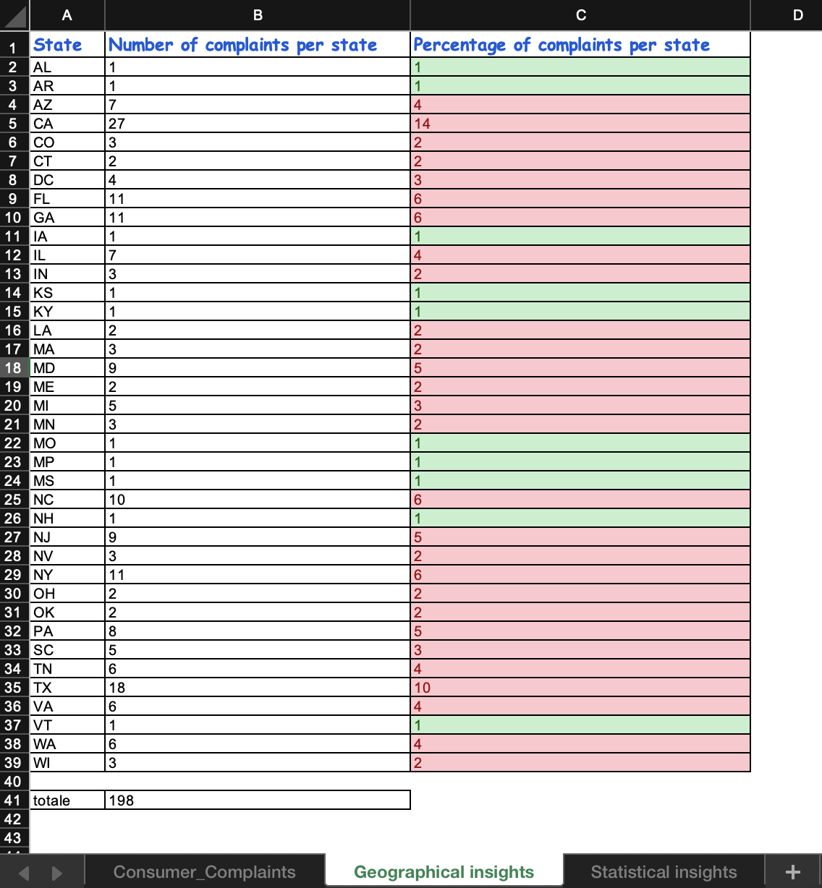

# 🏦 Consumer Complaints Analysis — Financial Services

## 📌 Panoramica del Progetto
Progetto realizzato durante il **Master in Data Analytics di ProfessionAI**, come capstone del modulo su Excel avanzato. Lo scenario di business — una società di customer care nel settore finanziario — è uno scenario simulato ideato per applicare le tecniche in un contesto realistico.

L'obiettivo è stato ristrutturare e riorganizzare un dataset complesso sui reclami dei consumatori per ottimizzare l'analisi geografica, velocizzare i processi decisionali e monitorare l'efficienza nei tempi di risposta aziendali.

**Dataset:** Fornito dal materiale didattico del Master in Data Analytics di ProfessionAI.

---

## 📊 Dashboard & Visual Preview

---

## 💡 Cosa dimostra questo progetto
* **Monitoraggio efficienza (SLA):** calcolo automatico dei giorni di gestione tra la ricezione del reclamo e l'invio alla compagnia, per tracciare la tempestività del servizio.
* **Analisi geografica mirata:** indicatori visivi e formattazione condizionale per evidenziare la concentrazione di reclami per Stato USA.
* **Analisi statistica delle problematiche:** identificazione univoca dei motivi di reclamo e individuazione della problematica più frequente tramite calcolo della moda.

---

## 🛠️ Architettura del Modello Excel
Il file si articola in 3 tab principali:
1. **`Consumer complaints`**: dataset principale ordinato per `Complaint ID`, con standardizzazione delle date, filtri temporali e calcolo dinamico dei tempi di risposta.
2. **`Geographical insights`**: analisi aggregata per Stato USA basata sulla funzione `COUNTIF` (`CONTA.SE`), calcolo delle incidenze percentuali e formattazione condizionale (verde < 2%, rosso ≥ 2%).
3. **`Statistical insights`**: estrazione delle tipologie uniche di reclamo e calcolo del valore moda tramite la funzione `MODE` (`MODA`).

---

## 👤 Autore
**Alessandro Gravagna**
Monza (MB), Italia
