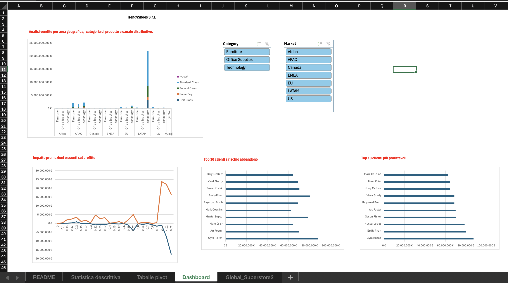

# 👠 Retail Sales Analysis & Interactive Reporting

## 📌 Panoramica del Progetto
Progetto realizzato durante il **Master in Data Analytics di ProfessionAI**, come capstone del modulo su Excel avanzato e Power Query. Lo scenario di business — una catena retail/e-commerce di calzature che vuole passare a un approccio data-driven — è uno scenario simulato ideato per applicare le tecniche in un contesto realistico.

Il progetto costruisce un sistema di Business Intelligence su Microsoft Excel basato sul dataset pubblico *Global Superstore*, con l'obiettivo di ottimizzare le vendite, i margini sulle promozioni e l'analisi dei trend stagionali.

**Dataset:** Global Superstore (dataset pubblico ampiamente usato per esercitazioni di BI)

---

## 📊 Executive Dashboard Preview

*(Figura 1: Report visivo interattivo con KPI di sintesi, analisi delle vendite per area e filtri temporali)*

---

## 💡 Cosa dimostra questo progetto
* **Ottimizzazione promozioni & margini:** analisi dell'impatto degli sconti sui profitti effettivi, per identificare i prodotti ad alta marginalità e ridurre le promozioni infruttuose.
* **Pianificazione scorte & stagionalità:** calcolo di medie mobili e tassi di crescita mensili per prevedere i picchi di domanda e ottimizzare il riassortimento.
* **Data-driven decision making:** dashboard interattiva con filtri visivi per decisioni rapide per regione e categoria.

---

## 🛠️ Architettura del Modello Excel
Il modello è organizzato nei seguenti tab:
1. **`Statistica descrittiva`**: calcolo di medie mobili (3 e 6 mesi), tassi di crescita (MoM/YoY), deviazione standard e indici di stagionalità.
2. **`Tabelle pivot`**: aggregazioni dinamiche di fatturato e profitti per area geografica, categoria prodotto e canale distributivo.
3. **`Dashboard`**: report visivo con KPI principali (fatturato, profitto netto, margine %), grafici dinamici e slicer interattivi.

---

## 👤 Autore
**Alessandro Gravagna**
Monza (MB), Italia
