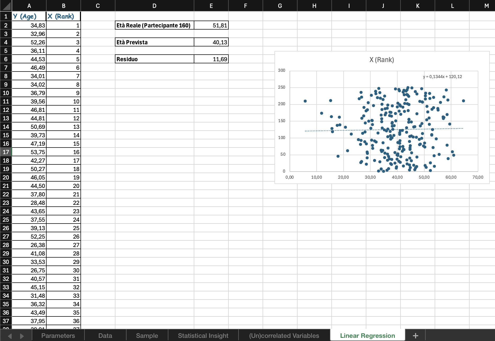

# 📊 Luggnagg Population Study — Simulation & Predictive Modeling

## 📌 Panoramica del Progetto
Progetto realizzato durante il **Master in Data Analytics di ProfessionAI**, come capstone del modulo su statistica e modellazione predittiva in Excel. *Luggnagg* è una popolazione fittizia (il nome è un omaggio ai Viaggi di Gulliver di Swift), usata come scenario per simulare un'analisi demografica in assenza di dati storici reali.

Il progetto simula un campione di 250 individui applicando tecniche di generazione di distribuzioni normali, campionamento condizionale, analisi di correlazione e modellazione tramite regressione lineare, per testare scenari e guidare decisioni strategiche in ambito aziendale.

---

## 📊 Scatterplot & Regression Preview

*(Figura 1: Modello di regressione lineare con scatterplot, equazione della retta ed estrapolazione predittiva)*

---

## 💡 Cosa dimostra questo progetto
* **Simulazione di scenari & risk management:** creazione di ambienti sintetici sicuri per testare ipotesi di mercato e modelli predittivi senza sostenere costi di raccolta dati.
* **Campionamento e segmentazione:** isolamento di sotto-campioni specifici per stime parametriche di confidenza e analisi di gruppo.
* **Analisi relazionale e predittiva:** valutazione delle relazioni causa-effetto tra variabili e costruzione di modelli di regressione lineare per identificare trend futuri.

---

## 🛠️ Architettura del Modello Excel
Il file è strutturato su 6 tab specializzati:
1. **`Parameters`**: interfaccia per l'impostazione dei parametri probabilistici di input (media, deviazione standard).
2. **`Data`**: generazione stocastica dell'età (distribuzione normale su 250 individui) e assegnazione casuale a 4 gruppi.
3. **`Sample`**: estrazione dinamica e filtraggio condizionale del sotto-campione tramite funzioni logiche (`IF` / `SE`).
4. **`Statistical Insight`**: calcolo di indicatori statistici, dimensione campionaria, tasso e intervallo di confidenza.
5. **`(Un)correlated Variables`**: elaborazione della matrice di correlazione tra l'età e variabili indipendenti.
6. **`Linear Regression`**: modellazione di regressione lineare con scatterplot, equazione della retta ed estrapolazione predittiva.

---

## 👤 Autore
**Alessandro Gravagna**
*Junior Data Analyst* | Monza (MB), Italia
