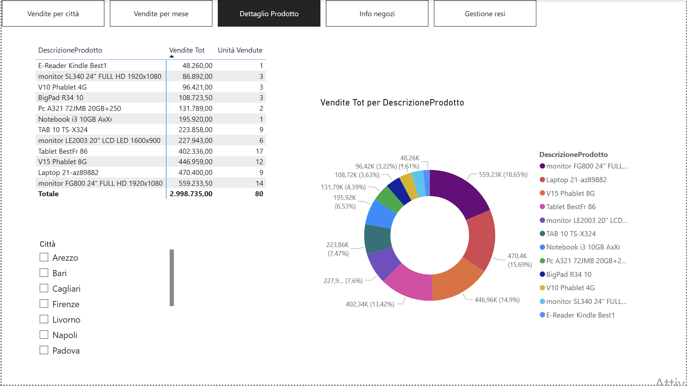
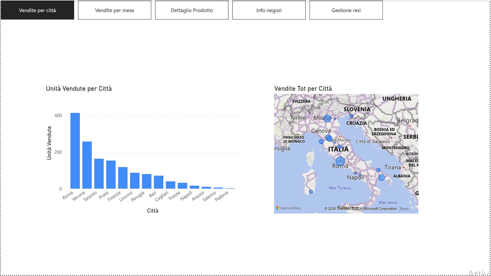

# 🏬 TechMarket S.p.A. — Sales Performance & Returns Analytics

## 📌 Panoramica del Progetto
Sviluppo di un sistema avanzato di Business Intelligence su **Microsoft Power BI** per **TechMarket S.p.A.**, primaria catena di distribuzione al dettaglio di elettronica di consumo in Italia. 
Il report integra le transazioni di vendita del 2014, i dati anagrafici dei punti vendita e la gestione dei resi per fornire all'Executive Board un quadro preciso e navigabile delle **vendite nette effettivi** e della redditività territoriale.

---

## 📊 Interactive Dashboard Preview

*(Figura 1: Analisi di dettaglio dei prodotti, quote di mercato su totale fatturato e filtri dinamici per città)*

*(Figura 2: Analisi geografica delle performance di vendita con distribuzione per città, mappa territoriale interattiva e menu di navigazione)*

---

## 💡 Valore Aggiunto Aziendale
* **Analisi Resi e Vendite Nette:** Calcolo dinamico del fatturato netto effettivo per punto vendita mediante l'integrazione contabile del modulo resi (gennaio/febbraio).
* **Geolocalizzazione delle Performance:** Mappatura geografica per identificare immediatamente i cluster regionali e le città top-performer (es. Roma e Verona).
* **UX/UI Navigabile con Bookmarks:** Menu di navigazione integrato con pulsanti d'azione e segnalibri (*Bookmarks*) per esplorare 5 aree di analisi senza affollare la visualizzazione.

---

## 📐 Modello Dati & Pipeline ETL (Power Query)
* **Data Ingestion & Merge:** Importazione ed elaborazione di file mensili e anagrafiche (Negozi, Prodotti, Province). Operazioni di `Merge` in Power Query per associare Prezzo Unitario, Descrizione Prodotto e Responsabile tramite chiavi relazionali (`Prodotto_ID`, `Store_ID`).
* **Star Schema:** Definizione di un modello relazionale a stella tra le tabelle di dimensione (`Dim_Prodotti`, `Dim_Negozi`) e le tabelle dei fatti (`Fact_Vendite`, `Fact_Resi`).
* **Misure DAX Implementate:**
  $$\text{Vendite Totali} = \sum (\text{Unità Vendute} \times \text{Prezzo Unitario} \times (1 - \text{Sconto}))$$
  $$\text{Vendite Nette} = \text{Vendite Totali} - \text{Valore Resi}$$

---

## 🖥️ Struttura delle 5 Aree di Report
1. **📍 Vendite per Città:** Istogrammi delle unità vendute e Mappatura Geografica Territoriale.
2. **📅 Vendite per Mese:** Trend temporale di andamento vendite, prezzi medi e sconti applicati.
3. **📦 Dettaglio Prodotto:** Donut Chart sulle quote di mercato e Slicers condizionali.
4. **🏪 Info Negozi:** Ranking Responsabili Store, fatturato totale e volumi per indirizzo.
5. **🔄 Gestione Resi:** Focus contabile sulle vendite nette al netto delle merci rese.

---

## 👤 Autore
**Alessandro Gravagna**  
*Junior Data Analyst* | Monza (MB), Italia
