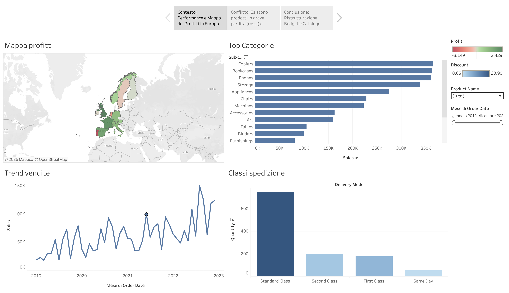

# 🇪🇺 Superstore Europa — Data-Driven Marketing Strategy & Tableau Storytelling

## 📌 Panoramica del Progetto
Progetto di Business Intelligence e Data Storytelling sviluppato su **Tableau** per **Superstore Europa**. La soluzione risponde alla necessità di sostituire la reportistica statica con sistemi dinamici per monitorare le operazioni europee e definire una **strategia data-driven di riallocazione del budget marketing** basata sul reale potenziale e margine dei prodotti.

🔗 **[Clicca qui per esplorare il Progetto Interattivo su Tableau Public](INSERISCI_QUI_IL_TUO_LINK_TABLEAU_PUBLIC)**

---

## 📊 Tableau Story Preview

*(Figura 1: Mappa coropletica dei profitti europei e scomposizione per classe di spedizione)*

---

## 💡 Valore Aggiunto Aziendale
* **Ottimizzazione Budget Marketing:** Identificazione analitica dei prodotti ad alto margine ma sottovalutati (da spingere), dei prodotti saturi/a basso margine (da ridurre) e dei prodotti in perdita da eliminare dal catalogo.
* **Data Storytelling (3C Framework):** Strutturazione visiva in formato *Tableau Story* basata sulla regola delle 3C (*Contesto, Conflitto, Conclusione*) per guidare l'Executive Board a decisioni rapide.
* **Geo-Analytics & Logistica:** Mappatura dei profitti per nazione/città e analisi dell'impatto dei costi delle classi di spedizione (*Standard, Express, Same Day*) per ridurre le inefficienze operative.

---

## 📖 Struttura del Tableau Story (3C Framework)
1. **Contesto:** Panoramica generale delle vendite e della profittabilità complessiva del mercato europeo.
2. **Conflitto:** Messa in evidenza delle inefficienze nel catalogo (prodotti ad alta marginalità poco valorizzati vs. prodotti ad alte vendite ma in perdita).
3. **Conclusione & Raccomandazioni:** Piano d'azione strategico per il riallocamento del budget pubblicitario e la razionalizzazione del catalogo.

---

## 🧰 Competenze Tecniche Utilizzate
* **Visual Analytics:** Tableau Stories, Dashboard Layouts responsive, Dashboard Actions (Highlight & Filter).
* **Campi Calcolati:** Calcolo dei margini %, indici di costo logistico e segmentazione condizionale del catalogo prodotti.
* **Deployment:** Pubblicazione e condivisione dell'applicazione interattiva su Tableau Public Cloud.

---

## 👤 Autore
**Alessandro Gravagna**  
*Junior Data Analyst* | Monza (MB), Italia
